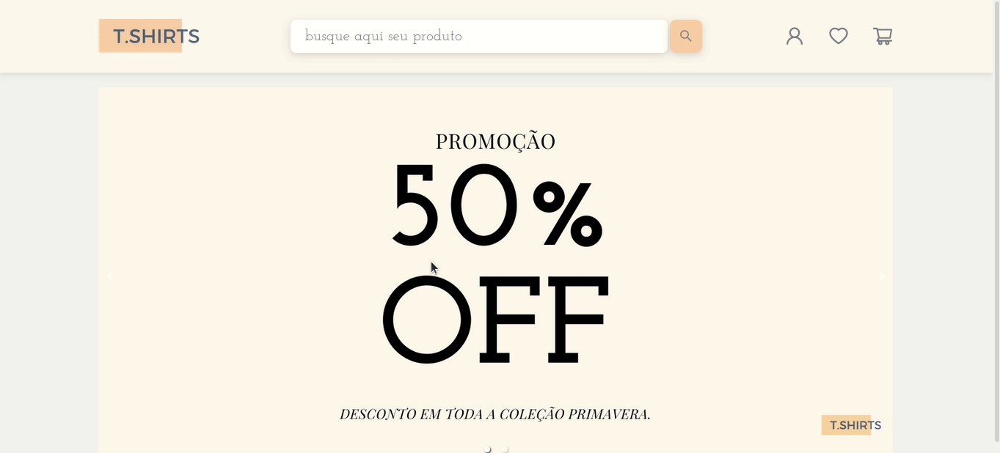

# Desafio Prático 1 - Calindra

In this web application, it is possible to search for products available in a virtual store.



## About

This is an web application where it is possible to search for your desired product.

- Search for a product by typing it in the text box
- Search for one or two terms at the same time
- See the list of found products 

## Technologies
The following tools and frameworks were used in the construction of the project:<br>
<p>
    
    
    
    
    
    
</p>

## How to run

1. Clone this repository
2. Install dependencies
```bash
npm i
```
3. Run with
```bash
npm start
```
4. You can optionally build the project running
```bash
npm run build
```
5. Finally access http://localhost:3000 on your favorite browser (unless it is Internet Explorer)